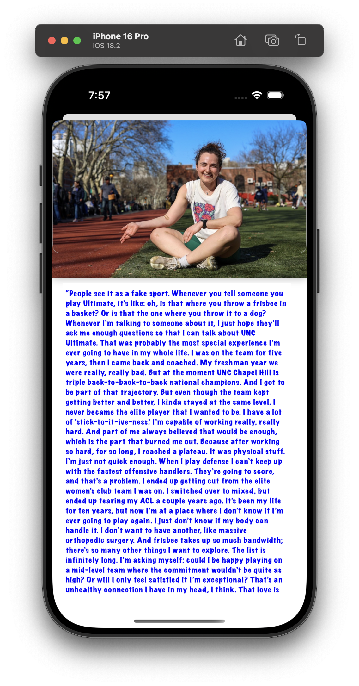

# Project 6 - *Tumblr*

Submitted by: **Michael Elder**

**Name of your app** is an app that ... [TODO] 

Time spent: **5** hours spent in total

## Required Features

The following **required** functionality is completed:

- [x] Setup navigation to the Detail Screen
- [x] Created the Detail View UI
- [x] Add the ability to pass data to the Detail View Controller
- [x] Made personal finishing touches to the UI

- modify font and color
- modify image view

The following **additional** features are implemented:

- No additonal features are implemented

## Video Walkthrough

    
    
  

## Notes
Outlet Connection & Module Misconfiguration
	•	Challenge: You got a runtime crash due to captionTextView not being key-value coding compliant — because the DetailViewController class was not properly set in the storyboard module.
	•	Fix: You correctly checked “Inherit Module from Target” and reconnected the IBOutlets.
 
 Data Not Passing to DetailViewController
	•	Challenge: Even after the segue was working, no data was showing because the segue wasn’t wired correctly or sender wasn’t valid.
	•	Fix: You updated the navigation logic and verified that the correct Post was passed via a temporary property.
