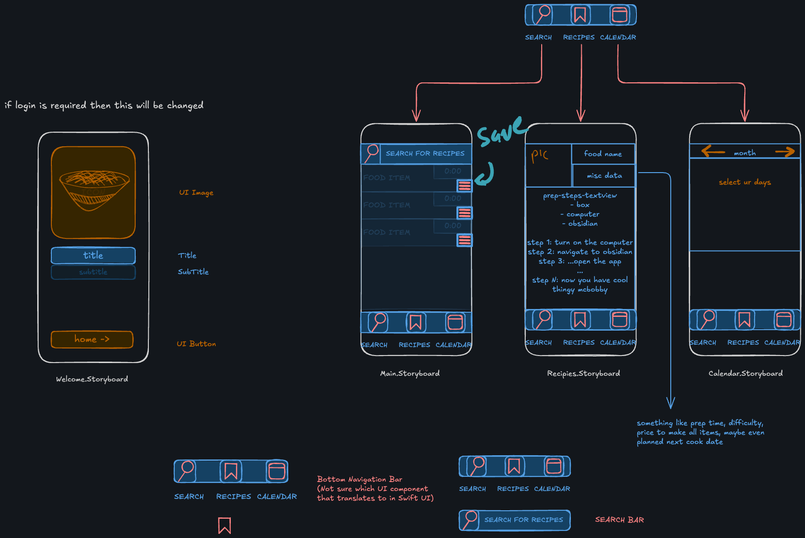

# Activity 1 - App Idea Brainstorming

## Inital Brainstorming 

The 6 project ideas I came up with for my IOS101 capstone project

ChoreChamp – Household chore tracker that splits tasks between roommates or family members.

MoodMate – Mood and emotion tracker with daily check-ins and journaling features.

BlueChili – Pantry inventory manager that helps reduce food waste and suggests recipes.

FitFlick – Lightweight workout tracker with animated exercise demos and routine planning.

SafeSteps – Personal safety app with emergency contact alerts, GPS tracking, and fake call triggers.

StudySpark – Simple study session timer with streak tracking, break reminders, and productivity stats.

EventEase – A simple event planner and RSVP tracker for small gatherings, study groups, or meetups.

## My 3 favorite ideas

SafeSteps – Personal safety app with emergency contact alerts, GPS tracking, and fake call triggers.

BlueChili – Pantry inventory manager that helps reduce food waste and suggests recipes.

StudySpark – Simple study session timer with streak tracking, break reminders, and productivity stats.

## Final App decision

BlueChili – Pantry inventory manager that helps reduce food waste and suggests recipes.

# Mock-Up

